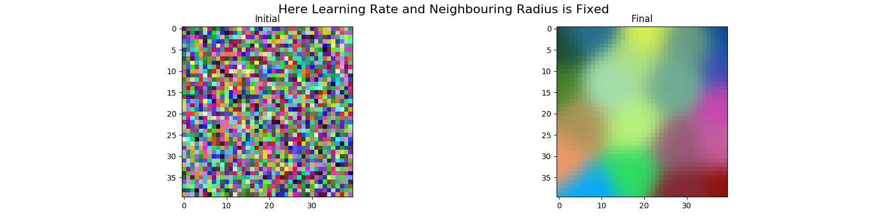

# Kohonen Self Organizing Feature Map

## Description
Implementation of kohonen self organizing feature map to map 3-Dimensional date to 2-Dimensional data.

in this specific problem we implement a som to organize and map a `40 * 40 RGB color map`  to 2-D map.

We implement this problem in three-phase:
1. Phase 1: Considering `Learning-Rate` and `Neighbouring-Radius` as <ins>**constant**</ins>. `(som.py)`
2. Phase 2: Consider `Learning-Rate` as <ins>**varying**</ins> rate. `(modified-lr-som.py)`
3. Phase 3: Consider `Neighbouring-Radius` as <ins>**varying**</ins> radius. `(modified-nr-som.py)`

## Getting Started
### Dependencies
Install dependencies by running following command:
\
```pip install -r requirements.txt```
### Executing
1. ```python som.py```
2. `python modified-lr-som.py`
3. `python modified-nr-som.py`
### Result
Result of `som.py` is something like this:
\
Left one showing initial color map and right one is organized color map.
\
 

### Authors
Amir Rezaei [@ameerezae](https://github.com/ameerezae)
